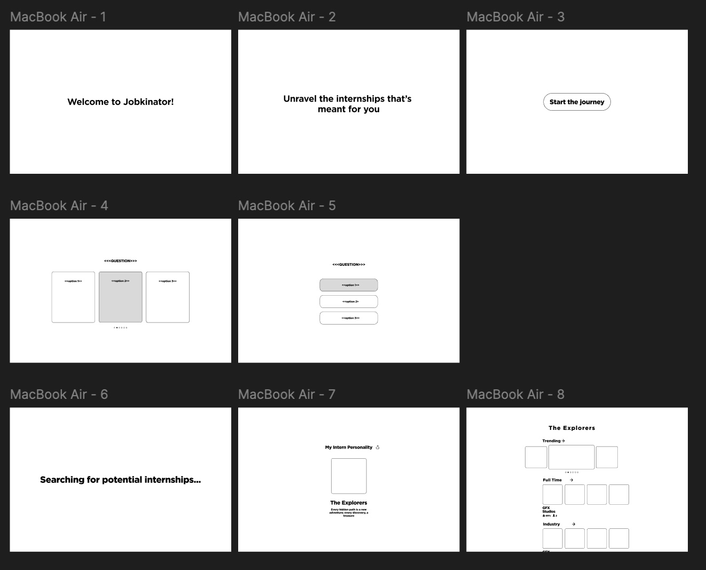

1. Project Title: Jobkinator (“Job-aKinator”)  
     
2. Project Summary:   
   We want to ‘gamify’ the process of applying to Full-Time Positions / Internships. This is accomplished through creating a custom set of filtered feeds for jobs that they are interested in. We can also let people access the interface directly using the filter to determine which jobs they want.

   As an extra layer on top of this concept we want to make it a social system where you can collect ‘streaks’ for continually applying to jobs much like duolingo and possibly have a friends system setup where you can track and update each other on progress. You can also combine this with the personality concept to come up with levels or experience points to further extend the game concept. The point is to drive motivation for applying to internships and encourage people to keep on applying

     
3. Description:   
   Looking for an internship can be a daunting task, as the market consists of hundreds or thousands of myriad companies specializing in different industries or products. Finding the right company can take a lot of time, so we want to create an application that will take some burden off the job seekers so that they can focus on refining their resume and technical knowledge while also looking at roles that they’d most likely be interested in.

   Creating a simple filter will do the job, however we want to add some extra incentives for students or job seekers to apply. We figured that we could best do that by gamifying the system: first, we create a Duolingo  questioning interface that will collect data about what type of role and company the applicant is looking for. Then, we maintain a database to track the ‘points’ of a user - the algorithm will take into account the streak of days someone has applied, the number of applications per day, etc. We will also add some additional features to make our app more feature-rich and user-friendly.

4. Creative Component (Technically Challenging Feature):  
   1. Daily streaks increase user engagement and promote people to keep on applying to jobs. To accomplish this we need to create database tracking info about each user and build relations to explore their usage of the site over time and also their engagement, e.g how many internships they applied to.
   2. Gamifying the job search process by incorporating interactive job quizzes. After completing the quiz, the app will display a personalized dashboard or curated job feed based on the user's responses.
   3. If we have time we can also do statistical analysis using aggregate functions and relations to build graphs of what jobs are being applied to the most or what fields are most popular right now.
        
5. Usefulness:  
   1. Internship finder for job hunter  
   2. Filter relevant internship to apply  
   3. Streak tracker creates incentive for user to apply everyday  
   4. Track current internship   
6. Realness:  
   1. We are going to maintain a database consisting of 2 tables:  
- NewGrad \+ Internship dataset sourced online in .csv form (Kaggle, Github, etc.). We are looking at datasets with 200+ internships/ new grad roles.  
- We will maintain a local database of users for tracking users’ progress (MySQL table). Because it is MySQL, the database should scale reasonably with the number of users in the audience  
- Database for total applications made on the website  
  1. Dataset  
     1. [https://www.kaggle.com/datasets/arshkon/linkedin-job-postings](https://www.kaggle.com/datasets/arshkon/linkedin-job-postings)  
     2. [https://www.kaggle.com/datasets/emreksz/software-engineer-jobs-and-salaries-2024](https://www.kaggle.com/datasets/emreksz/software-engineer-jobs-and-salaries-2024)  
7. Functionality:  
   1. UI Mockup:      
8.  CRUD Operations for Control Flow

A detailed description of the functionality that your website offers. This section outlines what the website delivers, focusing on how a user would interact with the application, specifically considering the **CRUD (Create, Read, Update, Delete)** operations for each major feature. The flow emphasizes what actions can be performed by users and administrators, and how data is managed throughout the application.

#### User:

- **Create**:

  - **Input**: `year`, `name`, `skills`, `current_streak`, `points`, `school_id`, `company_id`
  - **Action**: Creates a new user account with the given details, generating a unique `user_id`.

- **Read**:

  - **Where**: `user_id`
  - **Action**: Retrieves user information such as name, skills, current streak, and points.

- **Update**:

  - **Where**: `user_id`
  - **Input**: `year`, `name`, `skills`, `current_streak`, `points`, `school_id`, `company_id`
  - **Action**: Updates the user profile with new or altered information.

- **Delete**:

  - **Where**: `user_id`
  - **Action**: Deletes the user account and removes associated records.

#### Posting:

- **Create**:

  - **Input**: `posting_id`, `company_id`, `job_name`, `job_description`, `med_salary`, `sponsor`, `remote_allowed`, `location`, `post_date`, `ng_or_internship`
  - **Action**: Adds a new job posting for a specific employer, generating a unique `posting_id`.

- **Read**:

  - **Where**: `posting_id`, `filters` (e.g., location, remote\_allowed)
  - **Action**: Allows users to search and view job postings based on various filters.

- **Update**:

  - **Where**: `posting_id`
  - **Input**: `company_id`, `job_name`, `job_description`, `med_salary`, `sponsor`, `remote_allowed`, `location`, `post_date`, `ng_or_internship`
  - **Action**: Updates details of an existing job posting.

- **Delete**:

  - **Where**: `posting_id`
  - **Action**: Removes the job posting from the application.

#### Employer/Companies:

- **Create**:

  - **Input**: `company_id`, `company_name`, `description`, `url`, `address`
  - **Action**: Registers a new employer or company profile, generating a unique `company_id`.

- **Read**:

  - **Where**: `company_id`
  - **Action**: Retrieves company information such as name, description, and address.

- **Update**:

  - **Where**: `company_id`
  - **Input**: `company_name`, `description`, `url`, `address`
  - **Action**: Updates company details.

- **Delete**:

  - **Where**: `company_id`
  - **Action**: Deletes the company record and removes all related job postings.

#### School:

- **Create**:

  - **Input**: `school_id`, `school_name`, `school_size`, `school_address`
  - **Action**: Adds a new school record, generating a unique `school_id`.

- **Read**:

  - **Where**: `school_id`
  - **Action**: Retrieves details about a school.

- **Update**:

  - **Where**: `school_id`
  - **Input**: `school_name`, `school_size`, `school_address`
  - **Action**: Updates information about an existing school.

- **Delete**:

  - **Where**: `school_id`
  - **Action**: Deletes the school record from the database.

#### Applications (User-Posting Relationship):

- **Create**:

  - **Input**: `posting_id`, `user_id`, `application_date`
  - **Action**: Allows a user to apply to a specific job posting.

- **Read**:

  - **Where**: `user_id` or `posting_id`
  - **Action**: Retrieves the application status or a list of applicants for a job.

- **Update**:

  - **Where**: `posting_id`, `user_id`
  - **Input**: `application_date`
  - **Action**: Updates the application details, such as modifying the application date.

- **Delete**:

  - **Where**: `posting_id`, `user_id`
  - **Action**: Withdraws a user's application from a job posting.

#### Interview Questions (Company-Leetcode Problem Relationship):

- **Create**:

  - **Input**: `company_name`, `problem_id`
  - **Action**: Links a Leetcode problem with a company for use in interviews.

- **Read**:

  - **Where**: `company_name` or `problem_id`
  - **Action**: Retrieves information about which companies are using which problems.

- **Delete**:

  - **Where**: `company_name`, `problem_id`
  - **Action**: Removes the link between a company and a Leetcode problem.

9. Project Work Distribution:  
   1. Daniel: Backend, User Tracking and Database Management, Unit Testing  
      1. Hieu: Middleware, API Management, Ensuring that Front End matches with Backend for feature parity, Integration Testing and Work involving   
      2. Bose: Frontend, Frontend testing, creating pages involving job applications and filtering menus  
      3. Amy: Frontend, Frontend testing, creating pages involving user profiles and user personality management, UX/UI design, project vision leader. 