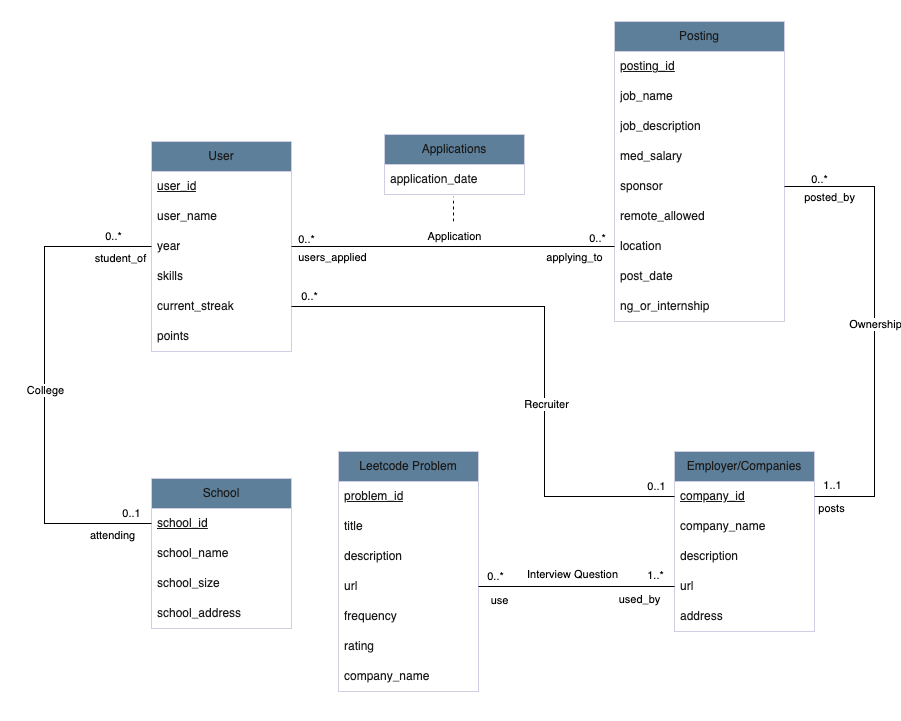

# fa24-cs411-team067-FallFun Database Design

## Submission Notes

1\. Does not have a submission located within the doc folder   
2\. Having a complete and correct ER/UML diagram  
3\. The ER/UML diagram has 5 or more entities 

	(See docs folder)

9\. Fix all suggestions for the previous stages
	
	(CRUD added \+ Fix Creative Component in proposal.md)

## Assumptions

## Entities:

* **User**: Each individual will have a unique account with attributes such as `name`, `skills`, `points`, and `current_streak`. It is an entity because the app involves different functionalities for users to interact with, such as applying to job postings, tracking streaks, or checking application history. This cannot be modeled as an attribute of another entity because it has distinct characteristics and interacts in various ways with other entities (e.g., posting applications, tracking streaks).

* **Posting**: A posting represents job listings from different companies for different roles available. It is an entity because users can apply to these postings, preparing for interviews and building skills relevant to certain jobs. The entity contains attributes such as `job_name`, `job_description`, or `sponsor`, which can be used for filtering in job searches. This is not an attribute of another entity because a posting stands alone with multiple properties and relationships (e.g., belongs to a company, receives applications from users).

* **Employer/Companies**: An employer represents companies that are hiring people. It is an entity because companies are central to job postings and interact with users through their job listings. The entity contains attributes such as `company_name`, `description`, or `url`. Companies are not attributes of a posting because they exist independently with their own properties, and have relationships not only with postings but also with users and problems.

* **Leetcode Problem**: A Leetcode problem represents a coding challenge used in the interview process when applying for software roles. It is an entity because users can practice these problems to prepare for interviews and build skills related to certain postings. The entity contains attributes such as `title`, `description`, or `url`. It is not an attribute of a company or user, as it has distinct properties and is used across various interview contexts, linking to companies in a many-to-many fashion.

* **School**: A school represents a university that the user is currently attending. It is an entity because users can add their educational background to their profiles, which may be used by employers for filtering candidates. The entity contains attributes such as `school_name`, `school_size`, or `address`. This cannot be modeled as an attribute of the user entity because a school has its own independent existence and could be linked to multiple users, making it necessary to keep it as a separate entity.

  ## Relationships:

* Application(User-Posting): It represents a many-to-many relationship because one user can submit their application to multiple postings, at the same time, one posting is associated with multiple applications from multiple users  
* Interview questions(Company-Leetcode Problem): It represents a many-to-many relationship because one company can have multiple leetcode problems in the interview questions, at the same time, a leetcode problem can be used in the interview by multiple companies.  
* College(User-School): It represents a one-to-many relationship because a user can only go to one school, but a school is associated with multiple users.  
* Ownership(Posting-Employer/Companies): It represents a one-to-many relationship because each posting belongs to only one company, but each company can post multiple postings for different roles in the company.  
* Recruiter(User-Employer/Companies): It represents a one-to-many relationship because each user belongs to only one company, but each company can be associated with multiple employees.

These assumptions arise from the fact that users have complex interactions with job application data. Each entity is designed to represent different components in the application process, making the database efficient and scalable. The relationships between entities show the connections between user’s applications, skills, and company roles, allowing a personalized feed and gamified user experience.

## UML

Transitioning from these assumptions, we now present the UML diagram that visually represents the entities and their relationships. This diagram will help solidify our conceptual understanding and serve as the foundation for the logical database design.

## 3NF Normalization:

Transitioning from the UML diagram, we now move into the normalization proof. In this section, we demonstrate that the supplied UML diagram is already normalized to 3NF by analyzing each entity independently and listing their functional dependencies.

school\_id \-\> school\_name, school\_size, school\_address  
problem\_id \-\>  title, description, problem\_url, frequency, rating   
company\_id \-\> company\_name, description, company\_url, company\_address  
user\_id \-\> user\_name, year, skills, current\_streak, points, **school\_id**, **company\_id**  
posting\_id \-\> job\_name, job\_description, med\_salary, sponsor, remote\_allowed, location, post\_date, ng\_or\_internship, **company\_id**  
applications\_user\_id, applications\_posting\_id \-\> applications\_user\_id, applications\_posting\_id, application\_date  
interview\_question\_problem\_id, interview\_question\_company\_id \-\> interview\_question\_problem\_id, interview\_question\_company\_id 

The first five functional dependencies are demonstrated by the five tables School, Leetcode Problem, Employer/Company, User and Posting. All non-prime attributes in each set are non-transitively dependent on only one candidate key, and are not dependent on each other. The interview question set has reflexive dependency, while application also includes an additional attribute called application\_date. They are both determined by a combination of two candidate keys, with each individual attribute not dependent on any sole non-prime attribute. Because these functional dependencies satisfy the rules of 3NF—having non-transitive and non-partial dependencies on the primary key—we conclude that the diagram is in 3NF.

## Logical Design:

Transitioning from the normalization proof, we now move to the logical design. In this section, we outline the relational schema, which details each table's attributes, primary keys, and foreign key relationships to provide a clear representation of how the database is structured.

applications(  
	posting\_id: int \[pk, fk to posting.posting\_id\],  
	user\_id: int \[pk, fk to user.user\_id\],  
	application\_date: datetime  
)

school(  
	school\_id: int \[pk\],  
	school\_name: varchar(256),  
	school\_size: int,  
	school\_address: varchar(256)  
)

leetcode\_problem(  
	problem\_id: int \[pk\],  
	title: varchar(64),  
	description: varchar(256),  
	company\_id: int \[fk to employer\_companies.company\_id\],  
	url: varchar(256),  
	frequency: int,  
	rating: int  
)

user(  
	user\_id: int \[pk\],  
	school\_id: int \[fk to school.school\_id\],  
	company\_id: int \[fk to employer\_companies.company\_id\]  
	year: int,  
	user\_name: varchar(256),  
	skills: varchar(512),  
	current\_streak: int,  
	points: int  
)

posting(  
	posting\_id: int \[pk\],  
	job\_name: varchar(256),  
	job\_description: varchar(256),  
	med\_salary: int,  
	sponsor: varchar(32),  
	remote\_allowed: varchar(10),  
	location: varchar(32),  
	post\_date: datetime,  
	ng\_or\_internship: varchar(32),  
	company\_id: int \[fk to employer\_companies.company\_id\]  
)

employer\_companies(  
	company\_id: int \[pk\],  
	company\_name: varchar(32),  
	description: varchar(256),  
	url: varchar(32),  
	address: varchar(64)  
)

interview\_question(  
	problem\_id: int \[pk, fk to leetcode\_problem.problem\_id\],  
	company\_name: int \[pk, fk to employer\_companies.company\_name\]  
)